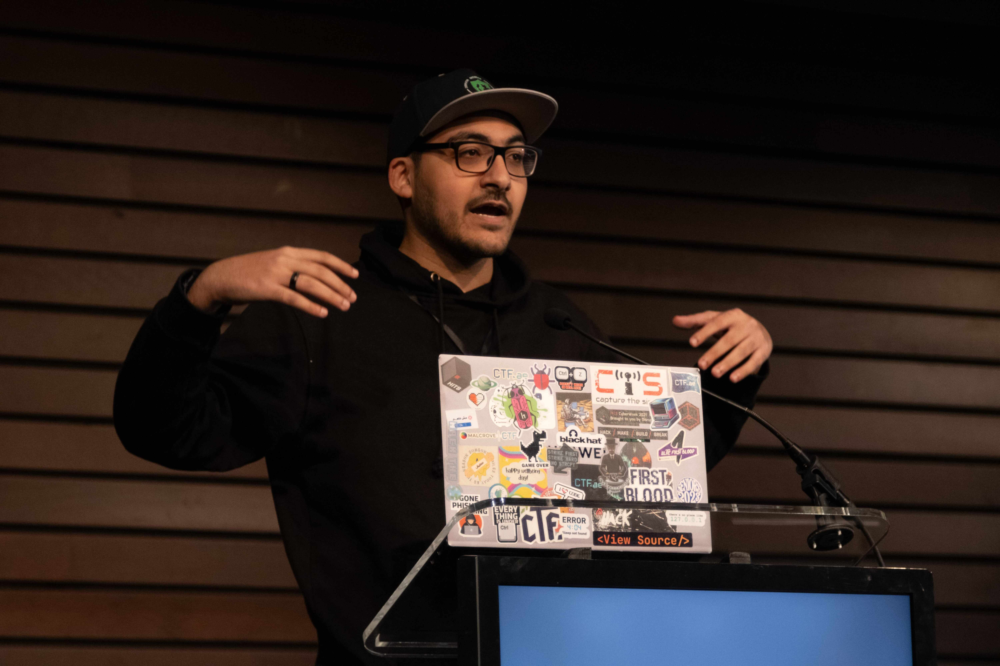

<h1 align="center"> Hi, I'm DeadPackets (Youssef Awad)!</h1>

  
  
  
  
  
  
  
  
  

---

  Won <b>"Best Emirati Startup"</b> with <a href="https://ctf.ae">CTFae</a> @ GISEC UAE 2024 
  Head of Engineering @ CTFae · Full-stack, DevOps &amp; security engineer who builds and ships with agentic AI · OSCP · Guinness World Record (largest CTF)  
  
  
  

---

## `$> whoami`

-  Head of Engineering & Co-Founder at [CTFae](https://ctf.ae)
-  OSCP-certified. I ship AI and break it like an attacker (5+ years in offensive security)
-  DevOps enthusiast. I automate everything
-  Cybersecurity educator and community builder
-  Computer Engineering graduate (+ CS minor) from [AUS](https://www.aus.edu)
- ⭐ Over my **{{ ACCOUNT_AGE }}** years on GitHub, I have opened **{{ ISSUES }}** issues, opened **{{ PULL_REQUESTS }}** PRs, pushed **{{ COMMITS }}** commits, created **{{ REPOSITORIES }}** repositories, contributed to **{{ REPOSITORIES_CONTRIBUTED_TO }}** projects, gathered **{{ STARS }}** stars across all my repos and gists

## `$> cat resume.txt`

| Period | Company | Role |
| ------ | ------- | ---- |
| 2021 - Present | [**CTFae**](https://ctf.ae) | Head of Engineering & Co-Founder |
| 2022 - Dec 2025 | [**Malcrove**](https://malcrove.com) | Senior Cyber Security Consultant |
| 2019 - 2024 | [**GDI.Foundation**](https://gdi.foundation) | Volunteer |

## `$> ls -la projects/`

⚙️ Platform &amp; Infrastructure

<table>
<tr>
<td>

Challenge Deployment API

Provisions containerized CTF challenges to AWS ECS on demand and auto-scales. Ran the world's largest CTF at 10,000+ concurrent users (BlackHat MEA, Guinness World Record).

  

</td>
<td>

CyberRanges

IaC platform that spins up multi-VM attack-defense environments across AWS and GCP.

  

</td>
</tr>
<tr>
<td>

Attack-Defense Checksystem

Real-time scoring for 100+ teams at once, with Celery workers and PgCat-pooled PostgreSQL.

  

</td>
<td></td>
</tr>
</table>

🤖 Agentic AI &amp; LLMs

<table>
<tr>
<td>

ProjectHailMary

Solo-operated agentic vulnerability finder. One orchestrator drives 60+ charter-bearing subagents through a validation gauntlet into a deterministic CLEAR / HOLD / REJECT verdict. 23 modules, 465+ tests.

</td>
<td>

LLM-AD-Defense

Autonomous SOC analyst on Gemini 2.5 Pro. It ingests Wazuh EDR alerts, reasons about the threat, and runs its own remediation, down to isolating a compromised Active Directory account.

 

</td>
</tr>
<tr>
<td>

<a class="proj-name" href="https://llmchess.deadpackets.pw">LLMChessArena</a>

Any LLM vs any LLM, Stockfish, or a human, over OpenRouter. Real-time WebSocket streaming, move-by-move Stockfish evals, and a live leaderboard. (<a href="https://github.com/DeadPackets/LLMChessArena">code</a>)

  

</td>
<td>

<a class="proj-name" href="https://trivia.deadpackets.pw">BuzzerMinds</a>

A live multiplayer trivia party game. Every question is LLM-generated and grounded against real sources via SearXNG, with fact cards and strict schemas to keep the AI honest.

  

</td>
</tr>
<tr>
<td>

<a class="proj-name" href="https://github.com/DeadPackets/PiCodeReview">PiCodeReview</a>

Multi-tier agentic code reviewer on the Pi SDK: cheap-model hunters over-report, a frontier-model judge re-reads the code and prunes the false positives. A 30-minute take-home challenge.

</td>
<td></td>
</tr>
</table>

📊 Data &amp; Web

<table>
<tr>
<td>

<a class="proj-name" href="https://projects.deadpackets.pw/VisualizeAUS/">VisualizeAUS</a>

20 years of my university's course data turned into an interactive exploration (Plotly + Quarto).

 

</td>
<td>

<a class="proj-name" href="https://github.com/DeadPackets/AUSCrawl">AUSCrawl</a>

The crawler behind it: pulls AUS's Banner registration system into a clean, analyzable dataset.

</td>
</tr>
<tr>
<td>

<a class="proj-name" href="https://projects.deadpackets.pw/DOSArchive/">DOSArchive</a>

My dad's (Yasser Awad) old DOS programs, emulated so you can run them right in your browser.

</td>
<td></td>
</tr>
</table>

<strong>See all my public projects</strong> Source code, live demos, and more, over in the gallery.

<a class="gallery-cta" href="https://projects.deadpackets.pw">Open gallery &rarr;</a>

## `$> cat skills.txt`

<h5>🤖 Applied AI / LLMs</h5>

I build systems that use LLMs, not train them

   

Multi-agent orchestration, RAG, evals &amp; guardrails, prompt engineering.

<h5>🛡️ Security</h5>

OSCP · 5+ years offensive

Penetration testing, red teaming, Active Directory, vulnerability assessment.

<h5>💬 Languages</h5>

Daily drivers

<h5>🎨 Frontend</h5>

Type-safe and modern

<h5>🔧 Backend &amp; APIs</h5>

Async, typed, queue-driven

Hono · Celery · Pydantic · SQLAlchemy

<h5>☁️ Cloud / DevOps</h5>

Ship it and automate it

## `$> cat life.txt | grep "Achievements"`

<b>🏆 Awards & Recognition</b>

- **[2024]** 🏆 **Guinness World Record** for the largest CTF in the world with CTFae @ BlackHat MEA 2024 ([link](https://x.com/Blackhatmea/status/1862171555683320251))
- **[2025]** 🏆 Won "Best Community Engagement" with CTFae @ UAE CyberSecurity Awards 2025 ([link](https://www.linkedin.com/posts/ctfae_in-light-of-the-national-initiatives-that-activity-7341558348380524544-0lXN))
- **[2024]** 🏆 Won "Best Emirati Startup" with CTFae @ GISEC UAE 2024 ([link](https://www.instagram.com/gisecglobal/p/C6Q2Ycbrejv))
- **[2024]** 🏆 Became the Official CTF Partner for GISEC UAE ([link](https://twitter.com/CTFae/status/1662279732287746051))
- **[2021]** 🏆 Awarded the "Outstanding CSE Student Talent Award" at AUS ([link](https://www.aus.edu/media/news/outstanding-computer-science-and-engineering-students-recognized-at-cse-annual-awards))
- **[2021]** 🏆 Created & hosted the longest CTF in UAE with CTFae ([link](https://ramadan.ctf.ae))

<b>💻 Events Hosted with CTFae</b>

- **[2025]** Hosted the first ever Bug Bounty CTF @ DEFCON 33 ([link](https://x.com/CTFae/status/1955398456899670141))
- **[2025]** Hosted the Dubai Cyber Security Challenge @ GITEX 2025 ([link](https://www.linkedin.com/posts/descofficial_dubai-cybersecurity-gisec2025-ugcPost-7323753058398535680-vfpl))
- **[2025]** Hosted the Bahrain National CTF ([link](https://www.linkedin.com/posts/fatma-ali-2a845928a_ctfbahrain-cybersecurity-ctfae-ugcPost-7354140444613652481-DJm6))
- **[2025]** Hosted BSides Nashville CTF (2nd year) ([link](https://bsidesnash.org/ctf))
- **[2024]** Hosted CTF @ GITEX GLOBAL showcasing Cyber Drill technology ([link](https://www.linkedin.com/posts/ctfae_after-a-week-of-online-qualifiers-20-elite-activity-7252717762324668416-N_PK))
- **[2024]** Hosted CTF for BSides Nashville (first USA CTF!) ([link](https://x.com/bsidesnash/status/1755003862102990952))
- **[2023]** Hosted the ADQ CTF ([link](https://www.linkedin.com/posts/ctfae_adq-in-partnership-with-malcrove-powered-activity-7151238726067593217-UpwB))
- **[2023]** Hosted CTF for BlackHat Saudi Arabia ([link](https://x.com/Blackhatmea/status/1724806987886874656))
- **[2023]** Hosted CTF for GITEX Africa in Morocco ([link](https://twitter.com/CTFae/status/1662279732287746051))
- **[2023]** Hosted CTF for HITB Amsterdam ([link](https://twitter.com/CTFae/status/1649553232904048640))
- **[2022]** Hosted Dubai Police CTF ([link](https://twitter.com/CTFae/status/1631349255330734080))
- **[2022]** Hosted CTF for the first BlackHat in Saudi Arabia ([link](https://twitter.com/SAFCSP/status/1589351916286287872))
- **[2022]** Hosted CTF for Government of Thailand @ TBCERT ([link](https://twitter.com/CTFae/status/1571053661564076040))
- **[2021]** Hosted the largest CTF in the Middle East @ AtHack ([link](https://athack.com/capture-the-flag))
- **[2021]** Hosted jeopardy CTF @ HITB CyberWeek ([link](https://cyberweek.ae/2021/jeopardy-ctf/))

<b>🎤 Speaking & Training</b>

- **[2024]** Gave CTFae's first Cyber Drill workshop @ HITB SecConf Thailand ([link](https://x.com/CTFae/status/1832755293404500239))
- **[2024]** Talk about CTFae's story and success @ CPX CyberAlley ([link](https://www.linkedin.com/posts/cpxholding_cyberalley-entrepreneurship-ai-ugcPost-7244338301061500929-0ZCS))
- **[2021]** 2-day training in Attack Defense CTFs @ HITB SECCONF ([link_1](https://www.youtube.com/watch?v=u9ypv7wY9o0)) ([link_2](https://www.youtube.com/watch?v=sGk4trFj5sU))
- **[2020]** Demonstrated password stealing Windows attack @ GISEC ([link](https://www.youtube.com/watch?v=EKp4WVupukY))
- **[2019]** Invited speaker @ DESC UAE

<b>🥇 CTF Competition Wins</b>

| Year | Place | Competition |
| ---- | ----- | ----------- |
| 2021 | 🥇 1st | The Hunt SOCathon @ GISEC ([link](https://www.linkedin.com/posts/cyberunittech_cyberunittech-socathon-gisec2021-activity-6806306706688118784-SogR)) |
| 2020 | 🥇 1st | CyberKnight CTF ([link](https://www.linkedin.com/feed/update/urn:li:activity:6709742565509369856)) |
| 2020 | 🥇 1st | CyberTalents UAE Regional CTF ([link](https://cybertalents.com/competitions/uae-national-cybersecurity-ctf-2020/teams)) |
| 2020 | 🥇 1st | HITB Lockdown CTF ([link](https://www.ctftech.com/events/open-battle-ctf/)) |
| 2019 | 🥇 1st | CyberBattle Of The Emirates ([link](https://www.eyeofriyadh.com/news/details/cyber-battle-of-the-emirates-victors-crowned-as-future-cyber-warriors-turn-up-the-heat-in-abu-dhabi-during-hitb-cyberweek-2019)) |
| 2019 | 🥈 2nd | HITB AI Challenge ([link](https://www.aus.edu/media/news/team-led-by-aus-computer-engineering-student-wins-2nd-place-in-ai-competition)) |
| 2019 | 🥉 3rd | CyberTalents Arab Regional CTF ([link](https://cybertalents.com/competitions/arab-regional-cyber-security-ctf-2019/teams)) |
| 2019 | 🥇 1st | CyberTalents UAE Regional CTF ([link](https://cybertalents.com/competitions/final-uae-national-cyber-security-ctf-2019/teams)) |
| 2019 | 🥇 1st | Dubai Police CTF ([link](https://trendingbusinessinsights.com/2019/02/25/three-winners-from-the-same-nationality-win-dubai-police-ctf-cybersecurity-challenge/)) |
| 2018 | 🥇 1st | CyberQuest Attack & Defence ([link](https://twitter.com/UAECyberQuest/status/1049276160876658688)) |
| 2016 | 🥇 1st | CyberQuest CTF ([link](https://gulfnews.com/uae/education/cyber-warriors-needed-to-protect-online-security-in-uae-1.1816234)) |
| 2016 | 🥈 2nd | NYU CSAW Forensics CTF ([link](https://sites.nyuad.nyu.edu/ccs-ad/csaw/)) |

## `$> git show stats`

  
  

## `$> spotify_cli --currently-playing`

  

  <i>This README generates every 3 hours. It was last generated Sunday, June 7th 2026, 12:59:25.</i>

