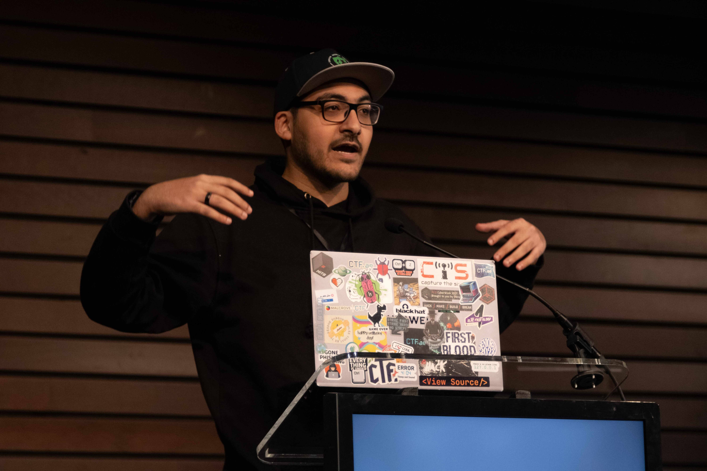

<h1 align="center"> Hi, I'm DeadPackets (Youssef Awad)!</h1>

<h3 align="center">💻 A passionate cybersecurity researcher, developer, engineer and hacker!</h3>

  
  
  
  
  
  
  
  

---

  Won <b>"Best Emirati Startup"</b> with <a href="https://ctf.ae">CTFae</a> @ GISEC UAE 2024 
  Head of Engineering & Co-Founder | Building world-class cybersecurity competitions  
  
  
  

---

## `$> whoami`

-  Computer Engineering graduate (+ CS minor) from [AUS](https://www.aus.edu)
-  Head of Engineering & Co-Founder at [CTFae](https://ctf.ae)
-  Passionate about CTFs, red teaming, and breaking things
-  DevOps enthusiast - I automate everything
-  Cybersecurity educator and community builder
-  Python & Docker evangelist
- ⭐ Over my **{{ ACCOUNT_AGE }}** years on GitHub, I have opened **{{ ISSUES }}** issues, opened **{{ PULL_REQUESTS }}** PRs, pushed **{{ COMMITS }}** commits, created **{{ REPOSITORIES }}** repositories, contributed to **{{ REPOSITORIES_CONTRIBUTED_TO }}** projects, gathered **{{ STARS }}** stars across all my repos and gists

## `$> cat resume.txt`

| Period | Company | Role |
| ------ | ------- | ---- |
| 2021 - Present | [**CTFae**](https://ctf.ae) | Head of Engineering & Co-Founder |
| 2022 - Dec 2025 | [**Malcrove**](https://malcrove.com) | Senior Cyber Security Consultant |
| 2019 - 2024 | [**GDI.Foundation**](https://gdi.foundation) | Volunteer |

## `$> ls -la projects/`

*Most of my meaningful and impactful work lives in private repositories at CTFae due to the sensitive nature of our cybersecurity platforms and client engagements.*

<!-- START OF PROFILE STACK, DO NOT REMOVE -->
| 💻 **Technology** | 🚀 **Projects** |
| - | - |
|  |   |
|  |   |
|  |   |
|  |  |
|  |     |
<!-- END OF PROFILE STACK, DO NOT REMOVE -->

## `$> cat skills.txt`

#### Languages

  

#### Technologies

  

#### Frameworks

  

#### DevOps

  

## `$> cat life.txt | grep "Achievements"`

<b>🏆 Awards & Recognition</b>

- **[2024]** 🏆 **Guinness World Record** for the largest CTF in the world with CTFae @ BlackHat MEA 2024 ([link](https://x.com/Blackhatmea/status/1862171555683320251))
- **[2025]** 🏆 Won "Best Community Engagement" with CTFae @ UAE CyberSecurity Awards 2025 ([link](https://www.linkedin.com/posts/ctfae_in-light-of-the-national-initiatives-that-activity-7341558348380524544-0lXN))
- **[2024]** 🏆 Won "Best Emirati Startup" with CTFae @ GISEC UAE 2024 ([link](https://www.instagram.com/gisecglobal/p/C6Q2Ycbrejv))
- **[2024]** 🏆 Became the Official CTF Partner for GISEC UAE ([link](https://twitter.com/CTFae/status/1662279732287746051))
- **[2021]** 🏆 Awarded the "Outstanding CSE Student Talent Award" at AUS ([link](https://www.aus.edu/media/news/outstanding-computer-science-and-engineering-students-recognized-at-cse-annual-awards))
- **[2021]** 🏆 Created & hosted the longest CTF in UAE with CTFae ([link](https://ramadan.ctf.ae))

<b>💻 Events Hosted with CTFae</b>

- **[2025]** Hosted the first ever Bug Bounty CTF @ DEFCON 33 ([link](https://x.com/CTFae/status/1955398456899670141))
- **[2025]** Hosted the Dubai Cyber Security Challenge @ GITEX 2025 ([link](https://www.linkedin.com/posts/descofficial_dubai-cybersecurity-gisec2025-ugcPost-7323753058398535680-vfpl))
- **[2025]** Hosted the Bahrain National CTF ([link](https://www.linkedin.com/posts/fatma-ali-2a845928a_ctfbahrain-cybersecurity-ctfae-ugcPost-7354140444613652481-DJm6))
- **[2025]** Hosted BSides Nashville CTF (2nd year) ([link](https://bsidesnash.org/ctf))
- **[2024]** Hosted CTF @ GITEX GLOBAL showcasing Cyber Drill technology ([link](https://www.linkedin.com/posts/ctfae_after-a-week-of-online-qualifiers-20-elite-activity-7252717762324668416-N_PK))
- **[2024]** Hosted CTF for BSides Nashville (first USA CTF!) ([link](https://x.com/bsidesnash/status/1755003862102990952))
- **[2023]** Hosted the ADQ CTF ([link](https://www.linkedin.com/posts/ctfae_adq-in-partnership-with-malcrove-powered-activity-7151238726067593217-UpwB))
- **[2023]** Hosted CTF for BlackHat Saudi Arabia ([link](https://x.com/Blackhatmea/status/1724806987886874656))
- **[2023]** Hosted CTF for GITEX Africa in Morocco ([link](https://twitter.com/CTFae/status/1662279732287746051))
- **[2023]** Hosted CTF for HITB Amsterdam ([link](https://twitter.com/CTFae/status/1649553232904048640))
- **[2022]** Hosted Dubai Police CTF ([link](https://twitter.com/CTFae/status/1631349255330734080))
- **[2022]** Hosted CTF for the first BlackHat in Saudi Arabia ([link](https://twitter.com/SAFCSP/status/1589351916286287872))
- **[2022]** Hosted CTF for Government of Thailand @ TBCERT ([link](https://twitter.com/CTFae/status/1571053661564076040))
- **[2021]** Hosted the largest CTF in the Middle East @ AtHack ([link](https://athack.com/capture-the-flag))
- **[2021]** Hosted jeopardy CTF @ HITB CyberWeek ([link](https://cyberweek.ae/2021/jeopardy-ctf/))

<b>🎤 Speaking & Training</b>

- **[2024]** Gave CTFae's first Cyber Drill workshop @ HITB SecConf Thailand ([link](https://x.com/CTFae/status/1832755293404500239))
- **[2024]** Talk about CTFae's story and success @ CPX CyberAlley ([link](https://www.linkedin.com/posts/cpxholding_cyberalley-entrepreneurship-ai-ugcPost-7244338301061500929-0ZCS))
- **[2021]** 2-day training in Attack Defense CTFs @ HITB SECCONF ([link_1](https://www.youtube.com/watch?v=u9ypv7wY9o0)) ([link_2](https://www.youtube.com/watch?v=sGk4trFj5sU))
- **[2020]** Demonstrated password stealing Windows attack @ GISEC ([link](https://www.youtube.com/watch?v=EKp4WVupukY))
- **[2019]** Invited speaker @ DESC UAE

<b>🥇 CTF Competition Wins</b>

| Year | Place | Competition |
| ---- | ----- | ----------- |
| 2021 | 🥇 1st | The Hunt SOCathon @ GISEC ([link](https://www.linkedin.com/posts/cyberunittech_cyberunittech-socathon-gisec2021-activity-6806306706688118784-SogR)) |
| 2020 | 🥇 1st | CyberKnight CTF ([link](https://www.linkedin.com/feed/update/urn:li:activity:6709742565509369856)) |
| 2020 | 🥇 1st | CyberTalents UAE Regional CTF ([link](https://cybertalents.com/competitions/uae-national-cybersecurity-ctf-2020/teams)) |
| 2020 | 🥇 1st | HITB Lockdown CTF ([link](https://www.ctftech.com/events/open-battle-ctf/)) |
| 2019 | 🥇 1st | CyberBattle Of The Emirates ([link](https://www.eyeofriyadh.com/news/details/cyber-battle-of-the-emirates-victors-crowned-as-future-cyber-warriors-turn-up-the-heat-in-abu-dhabi-during-hitb-cyberweek-2019)) |
| 2019 | 🥈 2nd | HITB AI Challenge ([link](https://www.aus.edu/media/news/team-led-by-aus-computer-engineering-student-wins-2nd-place-in-ai-competition)) |
| 2019 | 🥉 3rd | CyberTalents Arab Regional CTF ([link](https://cybertalents.com/competitions/arab-regional-cyber-security-ctf-2019/teams)) |
| 2019 | 🥇 1st | CyberTalents UAE Regional CTF ([link](https://cybertalents.com/competitions/final-uae-national-cyber-security-ctf-2019/teams)) |
| 2019 | 🥇 1st | Dubai Police CTF ([link](https://trendingbusinessinsights.com/2019/02/25/three-winners-from-the-same-nationality-win-dubai-police-ctf-cybersecurity-challenge/)) |
| 2018 | 🥇 1st | CyberQuest Attack & Defence ([link](https://twitter.com/UAECyberQuest/status/1049276160876658688)) |
| 2016 | 🥇 1st | CyberQuest CTF ([link](https://gulfnews.com/uae/education/cyber-warriors-needed-to-protect-online-security-in-uae-1.1816234)) |
| 2016 | 🥈 2nd | NYU CSAW Forensics CTF ([link](https://sites.nyuad.nyu.edu/ccs-ad/csaw/)) |

## `$> git show stats`

  
  

## `$> spotify_cli --currently-playing`

  

  <i>This README generates every 3 hours. It was last generated Saturday, January 24th 2026, 12:52:23.</i>

